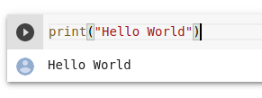
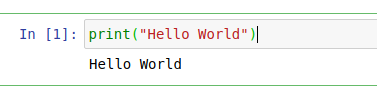

# RSES: Introduction to Deep Learning Course

Twin Karmakharm & Max Gamill

---

<!-- .slide: data-background="assets/img/rse-logo.svg" -->
<!-- .slide: data-background-opacity="0.2" -->

### Research Software Engineering Sheffield

* Increasing research impact through software
* Support and consultancy in research software and systems development and maintenance
    * Grant support
* Software optimisation, GPU and HPC
* Training, outreach and education activities
* Led by Dr. Paul Richmond
* Visit us at [https://rse.shef.ac.uk](https://rse.shef.ac.uk)

---

### Course Materials

All course materials can be found at:

[https://rses-dl-course.github.io/](https://rses-dl-course.github.io/)

---
### Course Schedule

* **09:00-10:05** | 01: Introduction to Deep Learning
* **10:05-10:15** | Break
* **10:20-12:00** | 02: Neural Networks
* **12:00-13:00** | Lunch
* **13:00-13:45** | 03: Classification and Convolutional Neural Networks
* **13:45-13:50** | Short break
* **13:50-15:15** | 04: Refining the model
* **15:15-15:30** | Break
* **15:30-17:00**
  * 05: Deployment & Transfer Learning
  * 06: DL in other fields & Wrapup

---
<!-- .slide: data-visibility="hidden" -->
### Course Schedule

* **Day one**
  * **13:00-14:10** | 01: Introduction to Deep Learning
  * **14:10-14:25** | Break
  * **14:25-15:35** | 02: Neural Networks
  * **15:35-15:50** | Break
  * **15:50-17:00** | 03: Classification and Convolutional Neural Networks
  
---
<!-- .slide: data-visibility="hidden" -->
### Course Schedule

* **Day two**
  * **13:00-14:30** | 04: Refining the model
  * **14:30-14:45** | Break
  * **14:45-15:30** | 05: Deployment & Transfer Learning
  * **15:30-16:00** | 06: DL in other fields
  * **16:00-16:15** | Break
  * **16:15-17:00** | 07: Final Exercise & Wrap-up
  
---

### Blackboard collaborate

Let us know how you're getting on with the course. 

<object type="image/svg+xml" data="assets/img/bbcolab.svg" style="background: white; width: 70%; height: auto;">
<param id="layer2" class="fragment" />
<param id="layer3" class="fragment" />
<param id="layer4" class="fragment" />
</object>

---
<!-- .slide: data-visibility="hidden" -->
### Google meet

Let us know how you're getting on with the course. 

<object type="image/svg+xml" data="assets/img/gmeet1.svg" style="background: white; width: 50%; height: auto;">
</object>

---
<!-- .slide: data-visibility="hidden" -->
### Google meet

Let us know how you're getting on with the course. 

<object type="image/svg+xml" data="assets/img/gmeet2.svg" style="background: white; width: 50%; height: auto;">
</object>

---
<!-- .slide: data-visibility="hidden" -->
### Google meet

Let us know how you're getting on with the course. 

<object type="image/svg+xml" data="assets/img/gmeet3.svg" style="background: white; width: 50%; height: auto;">
</object>

---
<!-- .slide: data-visibility="hidden" -->
### Google meet

Let us know how you're getting on with the course. 

<object type="image/svg+xml" data="assets/img/gmeet4.svg" style="background: white; width: 50%; height: auto;">
</object>

---

### Practical Labs Using Google Colab
A platform to run lab code interactively

`Shift+Enter` to run code, or use the 'Play' button on top-left 

`Ctrl+Space` to get code suggestion

---

### Practical Labs Using Jupyter Notebooks
A platform to run lab code interactively

`Shift+Enter` to run code

`Tab` to get code suggestion

