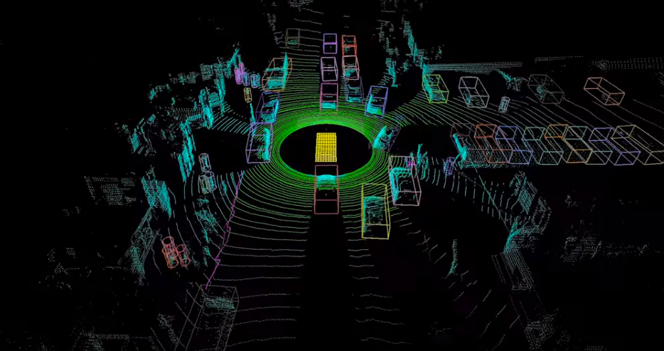

# 1. Introduction to Deep Learning

---

## Examples of deep learning

---

### Self-driving cars
 


<span class="small-note">[https://blogs.nvidia.com/blog/2020/03/11/drive-labs-multi-view-lidarnet-self-driving-cars/](https://blogs.nvidia.com/blog/2020/03/11/drive-labs-multi-view-lidarnet-self-driving-cars/)</span>

Note:
- One of the most well developed applications of DL is in self driving cars

Lidar can give autonomous vehicles laser focus. By bouncing laser signals off the surrounding environment, these sensors can enable a self-driving car to construct a detailed and accurate 3D picture of what’s around it.
-  cars, trucks, buses, pedestrians, cyclists, and other road users.
---

### Playing GO


<span class="small-note">[https://www.bbc.co.uk/news/technology-35785875](https://www.bbc.co.uk/news/technology-35785875)</span>

Note:
The Chinese board game is considered to be a much more complex challenge for a computer than chess.

2016: **A computer program has beaten a master Go player 3-0 in a best-of-five competition, in what is seen as a landmark moment for artificial intelligence.**

---

### Impersonating celebrities

<iframe width="560" height="315" src="https://www.youtube.com/embed/cQ54GDm1eL0" frameborder="0" allow="accelerometer; autoplay; encrypted-media; gyroscope; picture-in-picture" allowfullscreen></iframe>

Note:
Deepfakes are synthetic media[2] in which a person in an existing image or video is replaced with someone else's likeness.

Obviously dangerous but there is also ongoing research into using deep learning to detect deep fakes.
---

### Mars mission

<span class="medium-note">Terrain classification, navigation, autonomous rover, etc.</span>


<span class="small-note">DeepTerramechanics: Terrain Classification and Slip Estimation for Ground Robots via Deep Learning, R. Gonzalez, K. Iagnemma</span>

Note:
Terramechanics plays a critical role in the areas of ground vehicles and ground mobile robots since understanding and estimating the variables influencing the vehicle-terrain interaction may mean the success or the failure of an entire mission. 

This research applies state-of-the-art algorithms in deep learning to two key problems: estimating wheel slip and classifying the terrain being traversed by a ground robot
---

### What else?

* Cancer detection
* Auto-recommendation (videos, shopping preferences, etc.)
* Digital assistants (Google Assistant, Siri, Echo)
* Language translation
* And many more...

---

### Definitions


Note:
- AI: Mimicking the intelligence or behaviour of humans or any other living entity
- Machine Learning: A technique by which a computer can learn from data without using a complex set of rules.
- Deep Learning: A technique to perform machine learning based on neural networks.

---

### Machine Learning (ML)

Statistical models that learns from data 

---

### A simple ML model

<object type="image/svg+xml" data="assets/img/ml-model.svg"></object>

e.g. predicting house price from no. of bedrooms <!-- .element: class="fragment" -->


<object type="image/svg+xml" data="assets/img/ml-model-houseprice.svg">
<param id="layer1" class="fragment" />
</object>


---

### Learning by examples
ML models learn by being shown many examples. Each example is a pair of Feature (input) and Label (desired output).

<table>
<tr><th>Feature (No. of bedrooms)</th><th>Label (Sale Price)</th></tr>
<tr><td>3</td><td>185,000</td></tr>
<tr><td>1</td><td>70,000</td></tr>
<tr><td>4</td><td>250,000</td></tr>
</table>
<br/>
<object type="image/svg+xml" data="assets/img/feature-label.svg">
<param id="layer1" class="fragment" data-fragment-index="1" />
<param id="layer2" class="fragment" data-fragment-index="2" />
</object>


---

### Feature engineering
Real-world applications often does not map neatly to a single feature

e.g. here's what happens when we plot using real data:<br/>


---

### Feature engineering
It's possible to use multiple features in our model...

What other features should we collect?

Note:
Feature engineering is the process of using domain knowledge to extract features from raw data. 
---


### Feature engineering
Examples of features with higher correlation:


<div style="display:flex; width: 100%">
    <div style="flex-grow: 1">
    Overall quality of the finish <br/>
    </div>
    <div style="flex-grow: 1">
    Ground floor living area <br/> 
    </div>
</div>

---

### Feature engineering
* We want to choose features most relevant to our model e.g. ones with high correlation

* It's possible to combine and transform multiple features to increase correlation and help our ML algorithms e.g. 

    ```html
    Total area = Garden area + Ground floor area + Second floor area + ...
    ```

* Often requires domain knowledge and intuition about the dataset

---

### Feature engineering

What if we want to create a model that detect cats?


Each feature is a scalar value

---

### Feature engineering

Cat detector:

<div style="display:flex; width: 100%">
    <div style="flex-grow: 1">
        
    </div>
    <div style="flex-grow: 1">
    Possible features (Low -> High level)
        <ul>
            <li>Colours</li>
            <li>Edges</li>
            <li>Shapes</li>
            <li>Texture</li>
            <li>Anatomy (ears, eyes, mouth, face, limbs, etc.</li>
        </ul>
    </div>
</div>

---

### Feature engineering

Cat detector:


---

### ML Methodologies
We can use various algorithms as the 'model', DL is one of them...

* Clustering (e.g. K-means)
* Bayes
* Decision trees
* Regression
* State vector machines (SVM)
* Deep Learning (Neural Networks)
* etc.

---

### Deep Learning

Uses 'deep' neural networks, i.e. neural network with many layers.


---

### Why use Deep Networks
Standard ML workflow:


Standard DL workflow:


Deep layers acts as both model and feature detectors

---

### Hierarchical feature representaion 
Deep neural networks learn larger and more abstract features deeper into the network.

<object type="image/svg+xml" data="assets/img/convolution-hierachy.svg" style="background: white; width: 60%; height: auto;">
</object>


---

### Why use Deep Networks 
Why is this important? 

Imagine trying to convert our cat detector to a car detector:


With DL, just supply a different dataset! <!-- .element: class="fragment" -->

---

### The convergence
Three contributors to the rise of DL:

<div style="display:flex; width: 100%">
    <div style="flex-grow: 1">
        <div>
        
        </div>
        Algorithms
    </div>
    <div style="flex-grow: 1">
        <div>
            
        </div>
        Hardware
    </div>
    <div style="flex-grow: 1">
        <div></div>
        Data
    </div>
</div>

---


### Rise of Deep Learning

Alexnet network won the 2012 Imagenet competition with almost half error rate of existing algorithms

<br/>
[Alexnet (https://doi.org/10.1145/3065386)](https://doi.org/10.1145/3065386)<!-- .element: class="small-note" -->

Today's state-of-the-art is around 98.7% 

Note:
The rise of deep learning has had a clear impact on state of the art performance of machine learning models
---

### DL performance 

DL is able to use **more** data to increase performance 


<div>
... but also means you need <strong>more</strong> data to train DL algorithms
</div>

---

### DL Frameworks

Many DL frameworks are available, most popular being:

* [Tensorflow](https://www.tensorflow.org/)
  * The easiest framework to use (Keras)
  * Fast
* [PyTorch](https://pytorch.org/)
  * Dynamic network graph
  * Network debuggable
  

---

### DL Frameworks

There's likely a framework for a language that you know e.g.:

* Java - DL4J, Tensorflow Java
* Matlab - Deep Learning Toolbox

Or import from python
* 'keras' package for R - Used for R version of the course

---

### Keras (Tensorflow)

* High-level API for building and training NNs
* Pre-defined components for NN and training
  * Layers, Loss functions, Optimisers, Preprocessors
* Now integrated into Tensorflow

---

## Lab 01: Introduction to Tensorflow Keras
Linear regression with neural networks.

---

# Appendix

---

### Installing Tensorflow using conda

[conda(conda.io)](https://conda.io) is a virtual environment and package manager for many languages. 
It can be used to create a virtual python environment for installing tensorflow.

It's recommended if you plan to install tensorflow on your machine.

---

### Installing Tensorflow using conda

Once you've installed conda, you can create a virtual environment and install tensorflow with a single command:

```bash
conda create -n my_tensorflow_environment -y python=3.8 tensorflow
```

This installs the latest version of tensoflow on python version 3.8 in the virtual environment named 'my_tensorflow_environment'.
From tensorflow 2.0, the package `tensorflow` supports GPU by default.

---

### Running Tensorflow in virtual conda environment

You must then activate your virtual environment before running any tensorflow code:

```bash
source activate my_tensorflow_environment
python my_dl_script.py 
```

---

### Installing other packages

You can also install other packages with `conda` or `pip`:

```bash
pip install numpy
```

And it will be installed into your virtual environment

---

## Leaving the virtual environment

If you want to exit your conda environment, just run:

```bash
source deactivate
```
