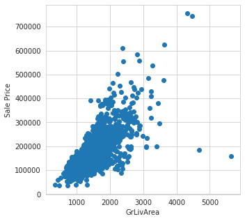
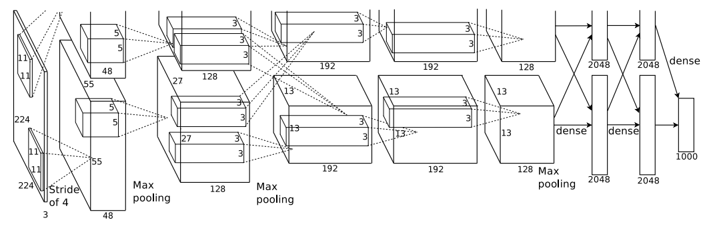
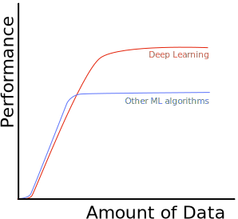

# 1. Introduction to Deep Learning

---

### Course Materials

All course materials can be found at:

[https://rses-dl-course.github.io/](https://rses-dl-course.github.io/)

---

### Course Schedule

* **09:00-10:30** | 01: Introduction to Deep Learning
* **10:15-10:30** | Break
* **10:30-13:00**
  * 02: Neural Networks
  * 03: Classification and Convolutional Neural Networks
* **13:00-14:00** | Lunch
* **14:00-15:30** | 04: Refining the model
* **15:30-15:45** | Break
* **15:45-17:00**
  * 05: Deployment & Transfer Learning
  * 06: DL in other fields & Wrapup
  
---

## Examples of deep learning

---

### Self-driving cars
 


<span class="small-note">[https://blogs.nvidia.com/blog/2020/03/11/drive-labs-multi-view-lidarnet-self-driving-cars/](https://blogs.nvidia.com/blog/2020/03/11/drive-labs-multi-view-lidarnet-self-driving-cars/)</span>

---

### Playing GO


<span class="small-note">[https://www.bbc.co.uk/news/technology-35785875](https://www.bbc.co.uk/news/technology-35785875)</span>

---

### Impersonating celebrities

<iframe width="560" height="315" src="https://www.youtube.com/embed/cQ54GDm1eL0" frameborder="0" allow="accelerometer; autoplay; encrypted-media; gyroscope; picture-in-picture" allowfullscreen></iframe>

---

### Mars mission

<span class="medium-note">Terrain classification, navigation, autonomous rover, etc.</span>


<span class="small-note">DeepTerramechanics: Terrain Classification and Slip Estimation for Ground Robots via Deep Learning, R. Gonzalez, K. Iagnemma</span>

---

### What else?

* Cancer detection
* Auto-recommendation (videos, shopping preferences, etc.)
* Digital assistants (Google Assistant, Siri, Echo)
* Language translation
* And many more...

---

### Definitions


---

### Machine Learning (ML)

Statistical models that learns from data 

---

### A simple ML model

<object type="image/svg+xml" data="assets/img/ml-model.svg"></object>

e.g. predicting house price from no. of bedrooms <!-- .element: class="fragment" -->


<object type="image/svg+xml" data="assets/img/ml-model-houseprice.svg">
<param id="layer1" class="fragment" />
</object>


---

### Learning by examples
ML models learn by being shown many examples. Each example is a pair of Feature (input) and Label (desired output).

<table>
<tr><th>Feature (No. of bedrooms)</th><th>Label (Sale Price)</th></tr>
<tr><td>3</td><td>185,000</td></tr>
<tr><td>1</td><td>70,000</td></tr>
<tr><td>4</td><td>250,000</td></tr>
</table>
<br/>
<object type="image/svg+xml" data="assets/img/feature-label.svg">
<param id="layer1" class="fragment" data-fragment-index="1" />
<param id="layer2" class="fragment" data-fragment-index="2" />
</object>


---

### Feature engineering
Real-world applications often does not map neatly to a single feature

e.g. here's what happens when we plot using real data:<br/>


---

### Feature engineering
It's possible to use multiple features in our model...

What other features should we collect?

---


### Feature engineering
Examples of features with higher correlation:


<div style="display:flex; width: 100%">
    <div style="flex-grow: 1">
    Overall quality of the finish <br/>
    </div>
    <div style="flex-grow: 1">
    Ground floor living area <br/> 
    </div>
</div>

---

### Feature engineering
* We want to choose features most relevant to our model e.g. ones with high correlation

* It's possible to combine and transform multiple features to increase correlation and help our ML algorithms e.g. 

    ```html
    Total area = Garden area + Ground floor area + Second floor area + ...
    ```

* Often requires domain knowledge and intuition about the dataset

---

### Feature engineering

What if we want to create a model that detect cats?


Each feature is a scalar value

---

### Feature engineering

Cat detector:

<div style="display:flex; width: 100%">
    <div style="flex-grow: 1">
        
    </div>
    <div style="flex-grow: 1">
    Possible features (Low -> High level)
        <ul>
            <li>Colours</li>
            <li>Edges</li>
            <li>Shapes</li>
            <li>Texture</li>
            <li>Anatomy (ears, eyes, mouth, face, limbs, etc.</li>
        </ul>
    </div>
</div>

---

### Feature engineering

Cat detector:


---

### ML Methodologies
We can use various algorithms as the 'model', DL is one of them...

* Clustering (e.g. K-means)
* Bayes
* Decision trees
* Regression
* State vector machines (SVM)
* Deep Learning (Neural Networks)
* etc.

---

### Deep Learning

Uses 'deep' neural networks, i.e. neural network with many layers.


---

### Why use Deep Networks
Standard ML workflow:


Standard DL workflow:


Deep layers acts as both model and feature detectors

---

### Hierarchical feature representaion 
Deep neural networks learn larger and more abstract features deeper into the network.

<object type="image/svg+xml" data="assets/img/convolution-hierachy.svg" style="background: white; width: 60%; height: auto;">
</object>


---

### Why use Deep Networks 
Why is this important? 

Imagine trying to convert our cat detector to a car detector:


With DL, just supply a different dataset! <!-- .element: class="fragment" -->

---

### The convergence
Three contributors to the rise of DL:

<div style="display:flex; width: 100%">
    <div style="flex-grow: 1">
        <div>
        
        </div>
        Algorithms
    </div>
    <div style="flex-grow: 1">
        <div>
            
        </div>
        Hardware
    </div>
    <div style="flex-grow: 1">
        <div></div>
        Data
    </div>
</div>

---


### Rise of Deep Learning

Alexnet network won the 2012 Imagenet competition with almost half error rate of existing algorithms

<br/>
[Alexnet (https://doi.org/10.1145/3065386)](https://doi.org/10.1145/3065386)<!-- .element: class="small-note" -->

Today's state-of-the-art is around 98.7% 

---

### DL performance 

DL is able to use **more** data to increase performance 



<div>
... but also means you need <strong>more</strong> data to train DL algorithms
</div>

---

## Lab 01: Introduction to Tensorflow Keras
Linear regression with neural networks.
