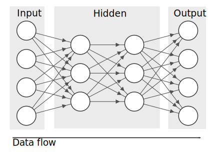

# 2. Neural Networks

---

## Artificial Neural Networks 

Artificial neural networks are inspired by biological neural networks found in animal brains.

---

## An artificial neuron
Behaviour is simplified compared to their biological counterparts...

Inputs ($x_{n}$) are multiplied with weights ($w_{n}$) and summed together with the bias ($b$).

---

## An artificial neuron
Behaviour is simplified compared to their biological counterparts...

$$
x_{1}w_{1}+x_{2}w_{2}+x_{3}w_{3}+b=y
$$

---

## A Neural Network
A neural network is simply a network of (artificial) neurons with distinct layers. 

---

## A Neural Network

The network is `acyclic`. Data is fed into the `Input` layer and prediction comes out at the `Output` layer. Any layers in-between is called the `Hidden` layer.

---

## Getting the right output

Neural network weights ($w$) and bias ($b$) are initialised at random.

The weights are then changed so that our `Output` is closer to the `Target`, minimising our `Error`

---

## Getting the right output

Let's try increasing $w_{1}$...

You'll see that error is increased from $9$ to $15$.

---

## Getting the right output

Now try decreasing $w_{1}$...

We've gotten nearer to our target, now we know to keep decreasing the weight.

---

## Gradient descent

Finding current loss gradient for ALL weights and changing the weights gradually to keep minimising error.

Above example shows the gradient descent process if we only have a single weight.

---

## Getting the right output (Sample 2)

With the next sample, the `Input` and `Target` has now changed... 

We need to minimise error for all samples.

---

## Neural Network Training Cycle

<object type="image/svg+xml" data="assets/img/neuralnetwork-training.svg" style="background: white; width: 50%">
<param id="layer2" class="fragment" data-fragment-index="2" />
<param id="layer3" class="fragment" data-fragment-index="3" />
<param id="layer4" class="fragment" data-fragment-index="4" />
</object>

---

## Neural Network Training Cycle

1. Forward propagation - Pass in data from sample
1. Calculate loss - compare output with target/label
1. Back propagation - change weights in the network to minimise error/loss
1. Repeat with different sample

