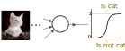

# 3. Classification and Convolutional Neural Networks

---

### Course Materials

All course materials can be found at:

[https://rses-dl-course.github.io/](https://rses-dl-course.github.io/)

---

### Course Schedule

* **09:00-10:05** | 01: Introduction to Deep Learning
* **10:05-10:20** | Break
* **10:20-12:00** | 02: Neural Networks
* **12:00-12:45** | Lunch
* **12:45-13:45** | 03: Classification and Convolutional Neural Networks
* **13:45-13:50** | Short break
* **13:50-15:15** | 04: Refining the model
* **15:15-15:30** | Break
* **15:30-17:00**
  * 05: Deployment & Transfer Learning
  * 06: DL in other fields & Wrapup
  
---


### Lesson contents

* Classification with neural networks
  * Logistic regression and softmax  
  * Cross entropy loss
  * One-hot encoding
* Convolutional Neural Networks
  * The convolution layer
  * The max-pooling layer

---

# Classification

---

### Classification

Logistic regression - the output is a confidence probability between $0$ (false) and $1$ (true).



---


### Classification

One output node per category.

<object type="image/svg+xml" data="assets/img/neuralnetwork-output2.svg" style="background: white; width: 70%; height: auto;">
</object>

---

### Classification outputs
For two categories, we an output vector size of **2**. Since its probabilities, we want the output vector to sum up to $1.0$.

<object type="image/svg+xml" data="assets/img/classification-onehot-probabiitysum.svg" style="background: white; width: 70%; height: auto;">
<param id="layer2" class="fragment" data-fragment-index="1" />
</object>

---

### Softmax
Bound output between $0$ and $1$ with **sigmoid** and **normalise** so output vector sums up to $1$.

<object type="image/svg+xml" data="assets/img/classification-softmax.svg" style="background: white; width: 70%; height: auto;">
</object>

---

### Classification labels

So what should our **labels/targets** look like?

<object type="image/svg+xml" data="assets/img/classification-onehot-cat.svg" style="background: white; width: 70%; height: auto;">
<param id="layer2" class="fragment" data-fragment-index="1" />
</object>

---

### Classification labels

What would be the **target** if we're classifying a dog?

<object type="image/svg+xml" data="assets/img/classification-onehot-dog.svg" style="background: white; width: 70%; height: auto;">
<param id="layer2" class="fragment" data-fragment-index="1" />
</object>

---

### One-hot encoding
Encode categories into vector form. Only **one** category should be **true**, hence **one-hot**.

<object type="image/svg+xml" data="assets/img/classification-onehot-3class.svg" style="background: white; width: 70%; height: auto;">
</object>


---

### Cross Entropy Loss

Larger penalty for classifying the wrong category.

```python
def get_entropy_loss(y, y_hat):
  if y ==1 :
    # Target is true
    return -math.log(y_hat)
  else:
    # Target is false
    return -math.log(1-y_hat)
```

Note: 
- Cross-entropy is used to measure the difference between two probability distribution p and q. 
- H(p,q) = - \Sum p(x) log q(x)
- In information theory, “surprise” of an event is used. An event is more surprising the less likely it is, meaning it contains more information.
- Low Probability Event (surprising): More information.
- Higher Probability Event (unsurprising): Less information.
- Skewed Probability Distribution (unsurprising): Low entropy.
- Balanced Probability Distribution (surprising): High entropy.

---

### Cross Entropy Loss

Larger penalty for classifying the wrong category.


---

### Cross Entropy Loss vs Squared Loss

Larger penalty for classifying the wrong category.


---

### Cross Entropy Loss

Several types of cross entropy loss available in `tf.keras`:

* **BinaryCrossentropy** - When there's **only** 2 labels, expects **one-hot** labels.
* **CategoricalCrossentropy** - When there's **2 or more** labels, expects **one-hot** labels.
* **SparseCategoricalCrossentropy** - When there's **2 or more** labels, expects **single integer** labels representing category.

---

## Convolutional Neural Networks

---

### Hierarchical feature representaion 
Deep neural networks learn larger and more abstract features deeper into the network.

<object type="image/svg+xml" data="assets/img/convolution-hierachy.svg" style="background: white; width: 60%; height: auto;">
</object>


---

### Building a deep network

Stack layers between `Input` and `Output` layers. 

<object type="image/svg+xml" data="assets/img/neuralnetwork-term.svg" style="background: white; width: 50%; padding: 1em">
<param id="layer2" class="fragment" data-fragment-index="1" />
<param id="layer3" class="fragment" data-fragment-index="2" />
<param id="layer4" class="fragment" data-fragment-index="4" />
<param id="layer5" class="fragment" data-fragment-index="3" />
</object>

---

### Fully connected/Dense layers

Each node in layer is connected to **every node** in the **previous** layer.

<object type="image/svg+xml" data="assets/img/convolution-dense2.svg" style="background: white; width: auto; height: auto;">
<param id="layer2" class="fragment" data-fragment-index="1" />
</object>

---

### Convolution Layer

<object type="image/svg+xml" data="assets/img/convolution-1d.svg" style="background: white; width: auto; height: auto;">
<param id="layer3" class="fragment " data-fragment-index="1" />
<param id="layer2" class="fragment fade-in-then-out" data-fragment-index="2" />
<param id="layer4" class="fragment fade-in-then-out" data-fragment-index="3" />
<param id="layer5" class="fragment fade-in-then-out" data-fragment-index="4" />
</object>

---

### Convolution Layer

* Each layer can have multiple filters (feature detectors)
* Each filter detects a single feature across the entire input space
  * `Kernel size` and `stride` used to control the convolution process
  * Same weights used for each filter
* Each node only connects to a subset of nodes in the previous layer
---

### Convolution in 2D

We arrange our input nodes as a grid to match our input image.

<object type="image/svg+xml" data="assets/img/convolution-gridinput.svg" style="background: white; width: auto; height: auto;">
<param id="layer1" class="fragment fade-out" data-fragment-index="1" />
<param id="layer2" class="fragment fade-in-then-out" data-fragment-index="1" />
<param id="layer3" class="fragment fade-in-then-out" data-fragment-index="2" />
</object>

---

### Convolution in 2D

Here's an example of a smaller convolution network (LeNet).

<object type="image/svg+xml" data="assets/img/lenet2.svg" style="background: white; width: 90% !important; height: auto;">
</object>

Each convolution layer has a number of filters, their outputs are represented as stacks of images.

---

### The convolution process

Scan filter of `kernel size` over the image with the step length of `stride`. It also determines the dimensions of the `output`.

<object type="image/svg+xml" data="assets/img/convolution-process.svg" style="background: white; width: auto; height: auto;">
<param id="layer2" class="fragment fade-in-then-out" data-fragment-index="2" />
<param id="layer3" class="fragment fade-in-then-out" data-fragment-index="3" />
<param id="layer4" class="fragment fade-in-then-out" data-fragment-index="4" />
<param id="layer5" class="fragment fade-in-then-out" data-fragment-index="5" />
<param id="layer6" class="fragment fade-in-then-out" data-fragment-index="6" />
<param id="layer7" class="fragment fade-in-then-out" data-fragment-index="7" />
<param id="layer8" class="fragment fade-in-then-out" data-fragment-index="8" />
<param id="layer9" class="fragment fade-in-then-out" data-fragment-index="9" />
<param id="layer10" class="fragment fade-in-then-out" data-fragment-index="10" />
</object>

---

### The convolution process

The output pixel is the weighted sum of the scanned area. The maths is the same as when connecting nodes together except the weight sharing!

<object type="image/svg+xml" data="assets/img/convolution-process-nodes.svg" style="background: white; width: auto; height: auto;">
<param id="layer2" class="fragment fade-in-then-out" data-fragment-index="2" />
<param id="layer3" class="fragment fade-in-then-out" data-fragment-index="3" />
<param id="layer4" class="fragment fade-in-then-out" data-fragment-index="4" />
<param id="layer5" class="fragment fade-in-then-out" data-fragment-index="5" />
<param id="layer6" class="fragment fade-in-then-out" data-fragment-index="6" />
<param id="layer7" class="fragment fade-in-then-out" data-fragment-index="7" />
<param id="layer8" class="fragment fade-in-then-out" data-fragment-index="8" />
<param id="layer9" class="fragment fade-in-then-out" data-fragment-index="9" />
<param id="layer10" class="fragment fade-in-then-out" data-fragment-index="10" />
</object>

---

### The convolution process

Filter weights remains the same as it scan over the image. It's detecting a single feature e.g. a vertical line.

<object type="image/svg+xml" data="assets/img/convolution-process-nodes.svg" style="background: white; width: auto; height: auto;">
<param id="layer2" class="fragment fade-in-then-out" data-fragment-index="2" />
<param id="layer3" class="fragment fade-in-then-out" data-fragment-index="3" />
<param id="layer4" class="fragment fade-in-then-out" data-fragment-index="4" />
<param id="layer5" class="fragment fade-in-then-out" data-fragment-index="5" />
<param id="layer6" class="fragment fade-in-then-out" data-fragment-index="6" />
<param id="layer7" class="fragment fade-in-then-out" data-fragment-index="7" />
<param id="layer8" class="fragment fade-in-then-out" data-fragment-index="8" />
<param id="layer9" class="fragment fade-in-then-out" data-fragment-index="9" />
<param id="layer10" class="fragment fade-in-then-out" data-fragment-index="10" />
</object>

---

### Convolution with multiple filters

Scan through the entire image again with a different filter for detecting a different feature, e.g. for a horizontal line.

<object type="image/svg+xml" data="assets/img/convolution-process-multifilter.svg" style="background: white; width: auto; height: auto;">
<param id="layer2" class="fragment fade-in-then-out" data-fragment-index="2" />
<param id="layer3" class="fragment fade-in-then-out" data-fragment-index="3" />
<param id="layer4" class="fragment fade-in-then-out" data-fragment-index="4" />
<param id="layer5" class="fragment fade-in-then-out" data-fragment-index="5" />
<param id="layer6" class="fragment fade-in-then-out" data-fragment-index="6" />
<param id="layer7" class="fragment fade-in-then-out" data-fragment-index="7" />
<param id="layer8" class="fragment fade-in-then-out" data-fragment-index="8" />
<param id="layer9" class="fragment fade-in-then-out" data-fragment-index="9" />
<param id="layer10" class="fragment fade-in-then-out" data-fragment-index="10" />
</object>

---

### Convolution with multiple filters

With multiple filters you'll get a 3D output `[filters, width, height]`.

<object type="image/svg+xml" data="assets/img/convolution-process-multifilter.svg" style="background: white; width: auto; height: auto;">
<param id="layer2" class="fragment fade-in-then-out" data-fragment-index="2" />
<param id="layer3" class="fragment fade-in-then-out" data-fragment-index="3" />
<param id="layer4" class="fragment fade-in-then-out" data-fragment-index="4" />
<param id="layer5" class="fragment fade-in-then-out" data-fragment-index="5" />
<param id="layer6" class="fragment fade-in-then-out" data-fragment-index="6" />
<param id="layer7" class="fragment fade-in-then-out" data-fragment-index="7" />
<param id="layer8" class="fragment fade-in-then-out" data-fragment-index="8" />
<param id="layer9" class="fragment fade-in-then-out" data-fragment-index="9" />
<param id="layer10" class="fragment fade-in-then-out" data-fragment-index="10" />
</object>

---

### Stacking convolution layers

Separate kernel for each input channel then sum its output matrices together. Repeat for the next filter.

<object type="image/svg+xml" data="assets/img/convolution-process-multichannel.svg" style="background: white; width: auto; height: auto;">
<param id="layer2" class="fragment fade-in-then-out" data-fragment-index="2" />
<param id="layer3" class="fragment fade-in-then-out" data-fragment-index="3" />
<param id="layer4" class="fragment fade-in-then-out" data-fragment-index="4" />
<param id="layer5" class="fragment fade-in-then-out" data-fragment-index="5" />
<param id="layer6" class="fragment fade-in-then-out" data-fragment-index="6" />
<param id="layer7" class="fragment fade-in-then-out" data-fragment-index="7" />
<param id="layer8" class="fragment fade-in-then-out" data-fragment-index="8" />
<param id="layer9" class="fragment fade-in-then-out" data-fragment-index="9" />
<param id="layer10" class="fragment fade-in-then-out" data-fragment-index="10" />
</object>

---

### Padding

Add padding to not lose details on the edges. Tensorflow's `same` padding automatically determine the amount of padding 
so that output size is same as input (if stride is 1).

<object type="image/svg+xml" data="assets/img/padding.svg" style="background: white; width: 30%; height: auto;">
</object>


---

### Max-pooling

Select the maximum number in the current kernel, used mainly for subsampling, reducing the overall network size.

<object type="image/svg+xml" data="assets/img/maxpool.svg" style="background: white; width: 60%; height: auto;">
</object>

---

### Putting it all together

We already know how to create dense networks, it's just a matter of adding `Convolution` and `Max pooling` layers!

<object type="image/svg+xml" data="assets/img/lenet2.svg" style="background: white; width: 90% !important; height: auto;">
</object>

---

## Lab 03: Image classification with CNNs
