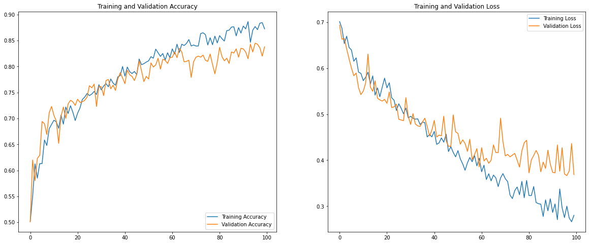
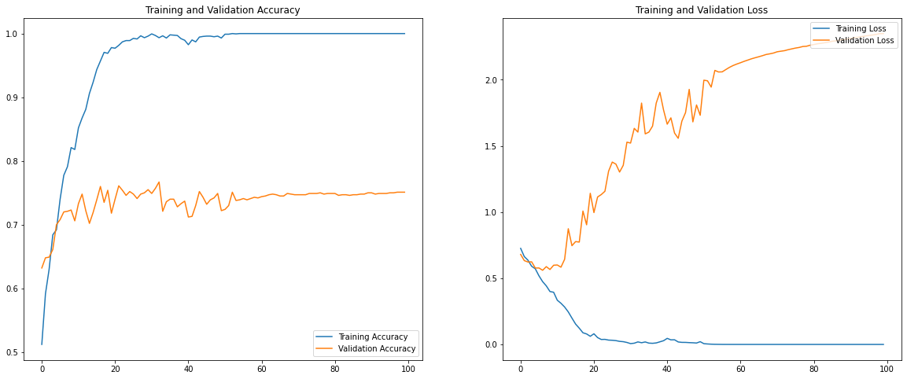

# 4. Improving the results of your model

---

### Lesson contents

* Visualising the model's performance
* Strategies to prevent underfitting and overfitting
* Data augmentation

---

### What do we want to improve about our model?
* Accuracy
* Generalisability
* Training time 

---

### Refresh: Datasets

Three types of datasets:

* **Training** dataset- Our model learns from **only** this dataset.
* **Validation** dataset - Used to check and fine-tune model's performance and generalisability.
* **Test** dataset - Used to check the performance of a **fully trained** model. Don't peek!

---

### Refresh: Validation datasets

It's not unusual to not be provided with a **validation** dataset. 

* Randomise and split a portion from your **training** dataset.
* Or perform a **k-folds** cross-validation.

---

### Measuring the model's performance

The trend of `Loss`, our measure of error, should decrease and `Accuracy` increase as the model trains.

This should happen for **both** `training` and `validation` datasets.

---

## Visualising Loss and Accuracy

Here's a loss and accuracy plots of the `training` and `validation` datasets.

---

### Confusion matrix
  
The confusion matrix visualises predicted classes against the actual label. A good way to highlight problems
in specific classes.

<object type="image/svg+xml" data="assets/img/confusion-matrix.svg" style="background: white; width: auto; height: auto;">
<param id="layer2" class="fragment fade-in-then-out" data-fragment-index="1" />
<param id="layer3" class="fragment fade-in-then-out" data-fragment-index="2" />
</object>

---

### Fitting the model to data

A well fitted model generalises well.

<object type="image/svg+xml" data="assets/img/data-fitting.svg" style="background: white; width: 80%; height: auto;">
</object>

---

### Underfitting

<object type="image/svg+xml" data="assets/img/data-fitting.svg" style="background: white; width: 80%; height: auto;">
</object>

Model not learning the function, training loss not decreasing.

Try increasing the model size or complexity, e.g. add nodes, layers or activation functions. <!-- .element: class="fragment" -->

---

### Overfitting

<object type="image/svg+xml" data="assets/img/data-fitting.svg" style="background: white; width: 80%; height: auto;">
</object>

Model learns the function too well and doesn't generalise. Training loss decreases but Validation loss increases. 
This is a big problem in DL!

---

### Overfitting

Model learns the function too well and doesn't generalise. Training loss decreases but Validation loss increases. 
This is a big problem in DL!

---

### Strategies to reduce overfitting

Strategies normally involves adding some kind of regularisation either to the network or the dataset.

* Reducing batch size - adds more noise every step.
* Reducing model size - so that model can't just 'remember' the dataset.
* Adding regularisation to the network e.g.:
  * L2 and L1 regularisation
  * Dropout
  * Batch normalisation
* Early stopping
* Data augmentation

Note:
The regularization term, or penalty, imposes a cost on the optimization function for overfitting the function or to make the optimal solution unique.
- L1: lasso regression
- L2 :  ridge regression. 
---

### Dropout

Randomly disable a percentage of inputs into the layer with the `rate` parameter. 

<object type="image/svg+xml" data="assets/img/dropout.svg" style="background: white; width: auto; height: auto;">
</object>

---

### Batch Normalisation

Normalising your dataset helps to smooth the loss surface and makes gradient descent faster. Batch normalisation follows
the same principle but the normalisation is done on a layer's output for each batch instead.

<object type="image/svg+xml" data="assets/img/normalisation.svg" style="background: white; width: 80%; height: auto;">
</object>

Note:
Batch normalization is a technique for training very deep neural networks that standardizes the inputs to a layer for each mini-batch. 

This has the effect of stabilizing the learning process and dramatically reducing the number of training epochs required to train deep networks.
---

### When do we stop training?

How many epochs should we train the model?

Like other hyperparameters, we won't know until we've started training.
<!-- .element: class="fragment" -->

But don't wait until your loss is $0$! 
<!-- .element: class="fragment" -->

---

### Early stopping

Stop as your `validation` loss starts to diverge. Your `validation` accuracy will also stop increasing or decrease at the time.

If the performance is good enough then the model can be used as-is.

<object type="image/svg+xml" data="assets/img/early-stop.svg" style="background: white; width: 50%; height: auto;">
</object>

---

## Refining your dataset

---

### How good is your data?

A good dataset is essential for getting good results! 
* Is it representative of real-world inputs?
  * Are there enough categories and what's the variance for each category?
* Is there enough data?
  * DL is especially data hungry and normally requires 100+ samples per category.
* Is your data clean?
  * Incorrect values, missing fields, duplicated entries, etc.

  
---

### How good is your data?

* Is your dataset balanced?
  * Ideal dataset has equal no. samples per category.
* Is there human bias in your dataset?
  * Can lead to many ethical concerns.

Note:

* Ethical concerns
  * Algorithms not recognising/misidentifying face e.g. Robert Julian-Borchak Williams leading to arrest

---

### Normalising inputs

It's important to normalise your features! It helps create a smoother loss surface and allow your network to train faster.

<object type="image/svg+xml" data="assets/img/normalisation.svg" style="background: white; width: 80%; height: auto;">
</object>

---

### Normalising inputs

Especially when there are big differences between the magnitude of your features e.g.:
* no. of bedrooms  1s-10s
* floor area ($m^2$) 100s-1000s
* house price (£) 100,000s-1,000,000s

<object type="image/svg+xml" data="assets/img/normalisation.svg" style="background: white; width: 80%; height: auto;">
</object>

---

### Don't forget to transform **all** of your inputs

Apply the same transformations e.g. normalisation, mean-shifting to all data coming in to your network 
and not just on the training set.

Pre-trained models should specify its transformations.

---

### Data Augmentation

Generating synthetic data from existing data in order to increase the size of your dataset. 
Helps increase generalisability and reduce overfitting.  

---

### Data Augmentation - Example transformations

<object type="image/svg+xml" data="assets/img/data-augmentation.svg" style="background: white; width: 80%; height: auto;">
</object>

---

### Feature selection

Not every feature has to be added to the network. Could you remove, combine or transform some features? 
ML feature engineering rules still apply!

---

## Lab 04 a & b: Data augmentation on dogs & cats dataset

