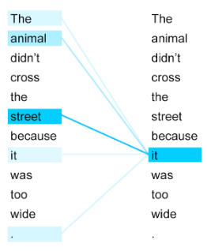

# 6. DL In other fields

---

### DL In other fields

Different architectures can be used to handle each domain's specific challenges and datatypes.

---

### Autoencoders

An `unsupervised` network that tries to recreate its input.

<object type="image/svg+xml" data="assets/img/autoencoder.svg" style="background: white; width: 60%; height: auto;">
<param id="layer2" class="fragment" data-fragment-index="1" />
<param id="layer3" class="fragment" data-fragment-index="2" />
<param id="layer4" class="fragment" data-fragment-index="3" />
<param id="layer5" class="fragment" data-fragment-index="4" />
</object>

---

### Autoencoders

They can be used for:

* Dimentionality reduction
* Denoising

---

### DL in NLP - From words to numbers

In NPL, it is common to have sequence of words as input and output. 

It's common practice tokenize and index every word.

<object type="image/svg+xml" data="assets/img/word-to-index.svg" style="background: white; width: 70%; height: auto;">
<param id="layer2" class="fragment" data-fragment-index="1" />
<param id="layer3" class="fragment" data-fragment-index="2" />
<param id="layer4" class="fragment" data-fragment-index="3" />
<param id="layer5" class="fragment" data-fragment-index="4" />
</object>

---

### Word embeddings

Reduce dimensionality, map relationships between words.

<object type="image/svg+xml" data="assets/img/embedding-transformation.svg" style="background: white; width: auto; height: auto;">
</object>

---

### Word embeddings

Reduce dimensionality, map relationships between words.

<object type="image/svg+xml" data="assets/img/glove-embedding.svg" style="background: white; width: 70%; height: auto;">
</object>

---

### Creating embedding from an n-gram network. 

A very simple way to create an embedding vector is to make an n-gram network which predicts the next word in the sentence.

<object type="image/svg+xml" data="assets/img/ngram-network.svg" style="background: white; width: 50%; height: auto;">
<param id="layer2" class="fragment fade-in-then-out" data-fragment-index="1" />
<param id="layer3" class="fragment fade-in-then-out" data-fragment-index="2" />
<param id="layer4" class="fragment fade-in-then-out" data-fragment-index="3" />
<param id="layer5" class="fragment fade-in-then-out" data-fragment-index="4" />
<param id="layer6" class="fragment fade-in-then-out" data-fragment-index="5" />
<param id="layer7" class="fragment fade-in-then-out" data-fragment-index="6" />
<param id="layer8" class="fragment fade-in-then-out" data-fragment-index="7" />
<param id="layer9" class="fragment" data-fragment-index="8" />
</object>

---

### RNNs and LSTMs for sequential inputs & outputs

RNNs are like a `for` loop in your network and allows for sequential input and output.

<object type="image/svg+xml" data="assets/img/rnns.svg" style="background: white; width: 70%; height: auto;">
</object>

---

### RNNs and LSTMs for sequential inputs & outputs

LSTMs (Long Short Term Memory) includes additional operations to solve `vanishing gradient` problem in standard `RNNs`.

<object type="image/svg+xml" data="assets/img/rnn-lstm.svg" style="background: white; width: 40%; height: auto;">
</object>

---

### Transformers

Newer language models are moving away from RNNs in favour of Transformers e.g. BERT, GPT.

<object type="image/svg+xml" data="assets/img/transformer.svg" style="background: white; width: 70%; height: auto;">
</object>

---

### Transformers

Newer language models are moving away from RNNs in favour of Transformers e.g. BERT, GPT.

<object type="image/svg+xml" data="assets/img/transformer-zoom.svg" style="background: white; width: 70%; height: auto;">
</object>

---

### Self-attention

A way of mapping how relevant other words are in relation to the current word:

[https://www.analyticsvidhya.com/blog/2019/06/understanding-transformers-nlp-state-of-the-art-models/](https://www.analyticsvidhya.com/blog/2019/06/understanding-transformers-nlp-state-of-the-art-models/) <!-- .element: class="small-note" -->

---

### Generative Adversarial Network

Generator generates random images from noise. Discriminator tries to distinguish whether image is real or fake.

<object type="image/svg+xml" data="assets/img/gan.svg" style="background: white; width: 70%; height: auto;">
<param id="layer2" class="fragment fade-in-then-out" data-fragment-index="1" />
</object>

---

### Reinforcement Learning

<object type="image/svg+xml" data="assets/img/reinforcement-learning.svg" style="background: white; width: 50%; height: auto;">
</object>

---

